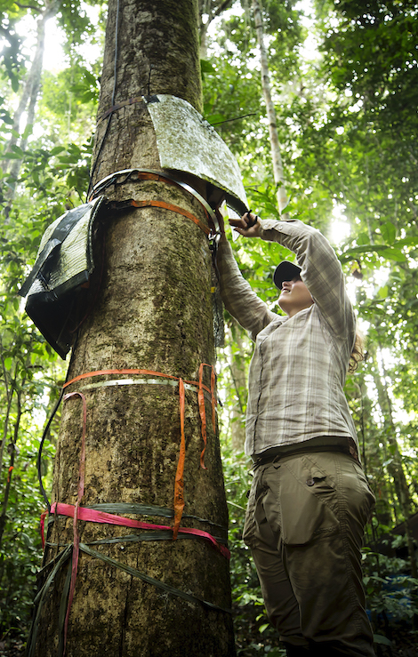

&nbsp;  *Repairing sap flow sensors in FLONA Tapajós.*  
Photo credit: [Joseph Xu ](http://www.josephxu.com/)

Thanks for reaching out! You can find me in the following places:
&nbsp;  &nbsp;  
**Email:** <agee.elizabeth.a@gmail.com>  
**Twitter:** [EcohydroLiz](http://twitter.com/ecohydroliz)  
**Github:** [laagee](https://github.com/laagee)  
&nbsp;  &nbsp;  
*Groups I've called home:*  
[ORNL Ecosystem Processes Group](https://www.ornl.gov/group/ecosystem-processes)  
[HydroWit](http://www-personal.umich.edu/~ivanov/HYDROWIT/HYDROWIT.html)  
&nbsp;  &nbsp;  
*Projects*  
[NGEE-Tropics](https://ngee-tropics.lbl.gov/)  
[Tropical Root Trait Initiative](https://tropiroottrait.github.io/TropiRootTrait/)  
[FoRTE](https://fortexperiment.github.io/fortedata/index.html)   
[UMBS](https://lsa.umich.edu/umbs)  
&nbsp;  &nbsp;  
*Service*  
[AGU Ecohydrology](https://www.aguecohydrology.org/)  
[Michigan-Earth Science Women's Network](https://www.facebook.com/groups/MESWN)  

