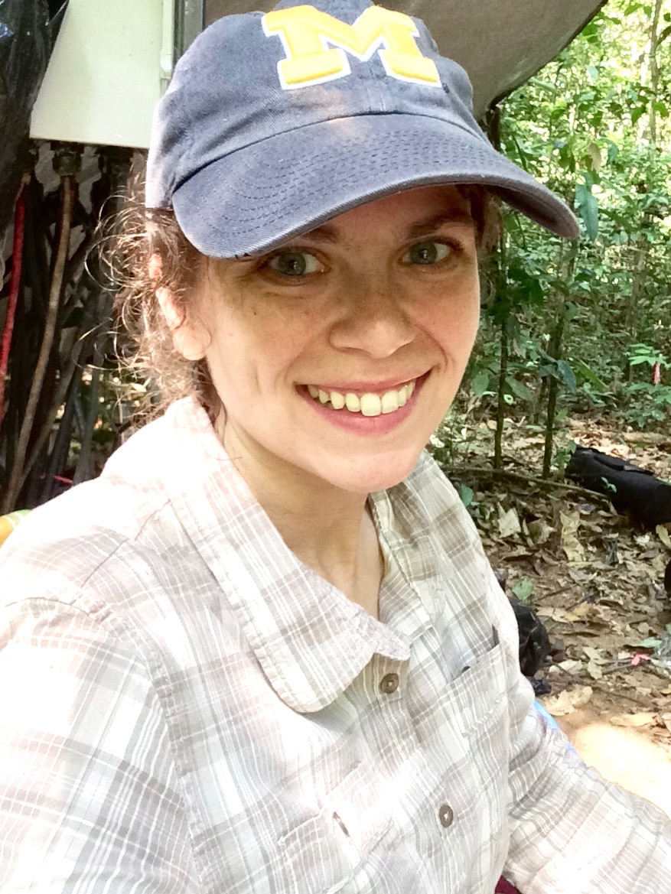

<link rel="stylesheet" href="styles.css" type="text/css">

I am a broadly trained ecohydrologist focusing on increasing the representation of root system structure and function in computational models to help better understand how forests will respond to shifting climate regimes. I am a Postdoctoral Research Associate at [Oak Ridge National Laboratory](https://www.ornl.gov/division/esd) working on the [NGEE-Tropics](https://ngee-tropics.lbl.gov/) project.
