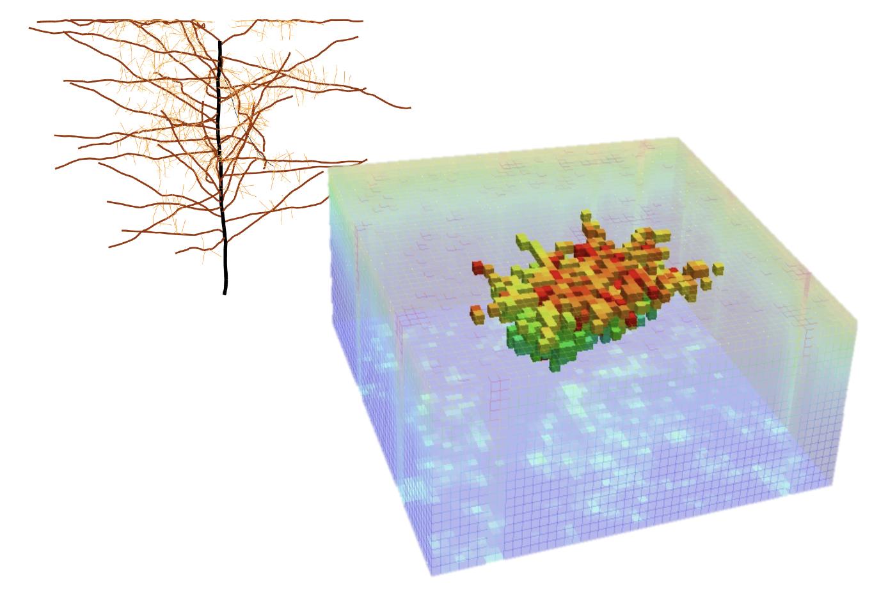
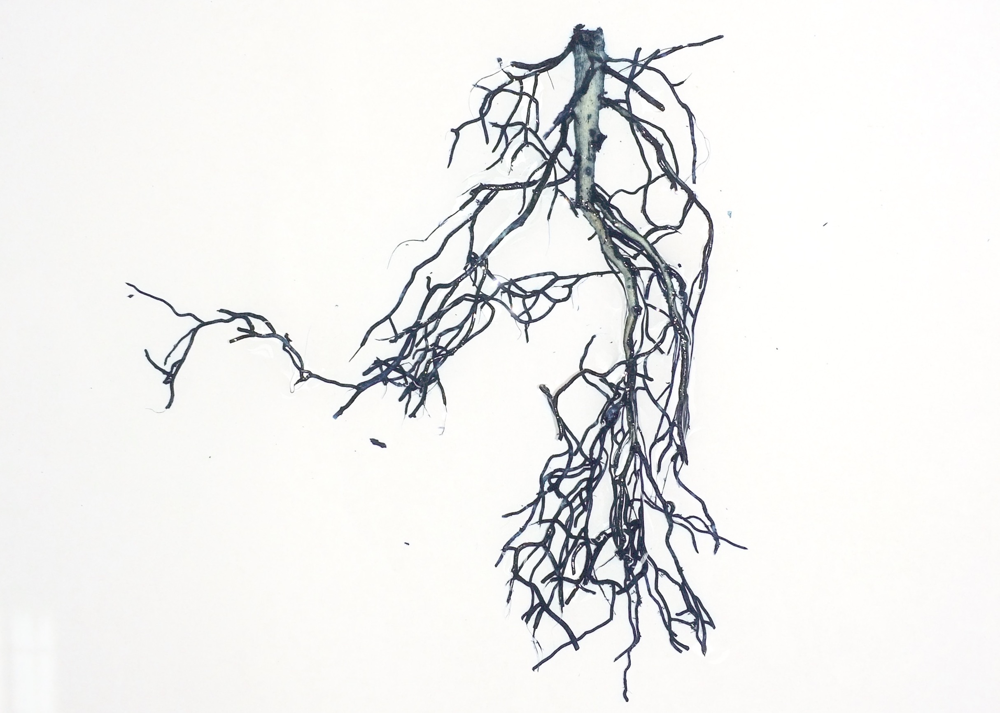
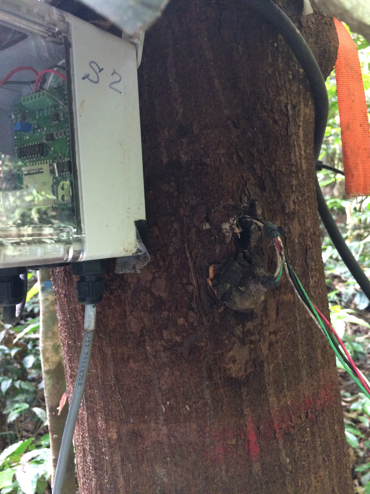
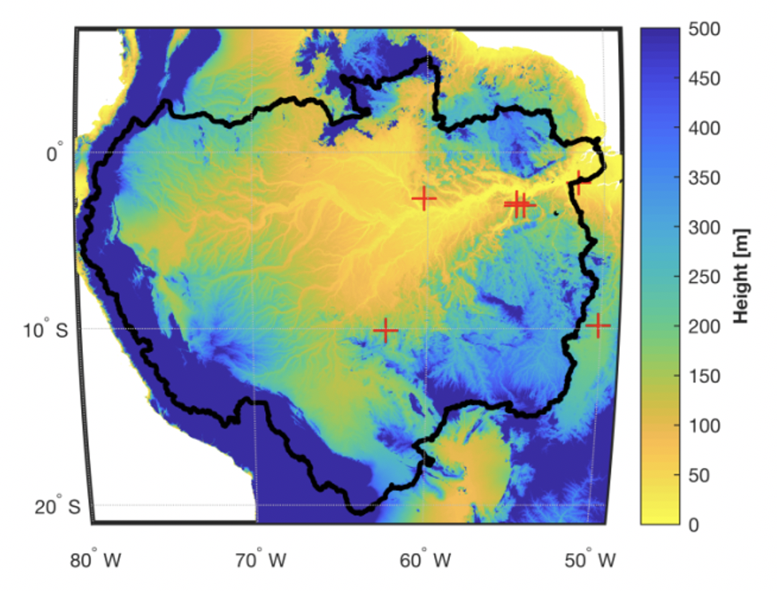

<link rel="stylesheet" href="styles.css" type="text/css">

&nbsp;  &nbsp;  

## Research Projects
&nbsp;  

  
&nbsp;  

### Representation of Roots in Models

Mechanistic representation of root system structure and function is an enormous opportunity for terrestrial biosphere models. For terrestrial water cycling, where as much as two-thirds of water returns to the atmosphere through the vegetative water pathway, the interface of the soil water supply and the plant system is critical for predicting plant responses to water limitation and drought.  &nbsp;  

PFLOTRAN-Root is a modified version of the PFLOTRAN reactive transport model which simulates three-dimensional root water uptake using the Couvreur macroscale hybridization technique. It has been applied to temperate and tropical forest systems to simulate individual water uptake for upwards of 1000 trees. &nbsp;  

**Agee, E.**, He L., Bisht, G., Couvreur, V., Shahbaz, P., Meunier, F., Gough, C.M., Matheny, A.M., Bohrer, G., and Ivanov, V.Y.  Root lateral interactions drive water uptake patterns under water limitation. 2021. Advances in Water Resources. [doi.org/10.1016/j.advwatres.2021.103896](https://doi.org/10.1016/j.advwatres.2021.103896)

Bisht, G., **Agee, E.**, He., L., Couvreur, V. and V.Y. Ivanov. PFLOTRAN-Root: a three-dimensional model of soil water physics and root water uptake. 2019. laagee/pflotran-dev-root-system: PFLOTRANRoot v0.0 (Version v0.0). Zenodo. [doi.org/10.5281/zenodo.3540881](http://doi.org/10.5281/zenodo.3540881)

 &nbsp;  &nbsp; 
 
 

  
&nbsp;  

### Quantifying Root Traits

Data from our below-ground systems is severely lagging behind our above-ground system. While some great resources exist (check out [FRED](https://roots.ornl.gov/) -- it's awesome!), more work needs to be done, especially for biodiverse systems like the tropics. Previously, I participated with the [Tropical Root Trait Initiative](https://tropiroottrait.github.io/TropiRootTrait/) to help gather together published and unpublished root trait data for tropical systems so we can use it pose research questions, test hypotheses, and generate knowledge needed for our next generation of below-ground models. &nbsp; 

Cusack, D.F., Addo-Danso, S.D., **Agee, E.A**., Andersen, K.M., Arnaud, M., Batterman, S.A., Brearley, F.Q., Ciochina, M.I., Cordeiro, A.L., Dallstream, C. and Diaz-Toribio, M.H., 2021. Tradeoffs and synergies in tropical forest root traits and dynamics for nutrient and water acquisition: field and modeling advances. Frontiers in Forests and Global Change, p.161. [doi.org/10.3389/ffgc.2021.704469](https://doi.org/10.3389/ffgc.2021.704469)

 &nbsp;  &nbsp; &nbsp;  

  
&nbsp;  
*This tree in the FLONA Tapajós (Brazilian Amazon) has grown and is beginning to eat the sensor.*

### Brazilian Amazon
During my graduate studies in the [HydroWit](http://www-personal.umich.edu/~ivanov/HYDROWIT/HYDROWIT.html) lab, I helped build and deploy various networks of sensors to quantify water fluxes and stress in trees. These sensors, paired with concurrent below-ground observations, help give insights into the links between above-ground water demands and below-ground water supplies. You can read more about our work in the Brazilian Amazon in the press stories below and in future publications. 

“Solve for Life.” *Re-engineering Radio* and *Michigan Engineering*. Story: Gabriel Cherry. Photos: Joseph Xu. 2019.  [podcast](https://shows.pippa.io/re-engineering-radio/episodes/solve-for-life), [article](https://news.engin.umich.edu/features/solve-for-life/)  
&nbsp;  
“Hands-on in the Amazon.” *Michigan Engineering*. Story: Gabriel Cherry. Photos: Joseph Xu. July 2019. [article](https://news.engin.umich.edu/2019/07/hands-on-in-the-amazon/)

&nbsp;  &nbsp;  

### University of Michigan Biological Station 
Check out the [FoRTE data package](https://fortexperiment.github.io/fortedata/index.html) available in R! 

Atkins J.W., **Agee, E.**, Barry, A., Dahlin, K.M., Dorheim, K., Haber, L.T., Hickey, L.J., Grigri, M.S., Mathes, K., McQuigan, C., Paris, E., Pennington, S.C., Rodriguez, C., Shafer, A., Shiklomanov, A., Tallant, J., Gough, C.M., and Bond-Lamberty, B. The fortedata R package: open-science datasets from a manipulative experiment testing forest resilience. 2020. Earth System Science Data. https://doi.org/10.5194/essd-13-943-2021. 

Gough, C.M., Atkins, J.W., Bond-Lamberty, B., **Agee, E.**, Dorheim, K., Fahey, R., Grigri, M., Haber, L., Mathes, K., Pennington, S., Schiklomanov, A., Tallant, J. Diversity, structure and complexity as predictors of carbon cycling resistance to disturbance. 2020. Ecosystems; 24(3). https://doi.org/10.1007/s10021-020-00544-1. 

 &nbsp;  &nbsp;  &nbsp;  

 

### Remotely-sensed Evapotranspiration

As a NASA Earth and Space Science Fellow, I used data from the Geostationary Operational Environmental Satellite (GOES) to estimate long-term hourly evapotranspiration for the entire Amazon River Basin using the Maximum Entropy Production model (MEP). Despite using fewer parameters than the gold-standard Penman-Monteith evapotranspiration models, our results show that the MEP method improves estimates of ET for tropical regions like the Amazon rainforests where cloud cover and dense vegetation increase observational uncertainty.  

Xu, D., **Agee, E.**, Wang, J., and Ivanov,V.Y. Estimation of Evapotranspiration of Amazon rainforest with Maximum Entropy Production Theory. 2019. *Geophysical Research Letters.* [doi: 10.1029/2018GL080907](https://agupubs.onlinelibrary.wiley.com/doi/abs/10.1029/2018GL080907) **Top 10% Downloaded**

