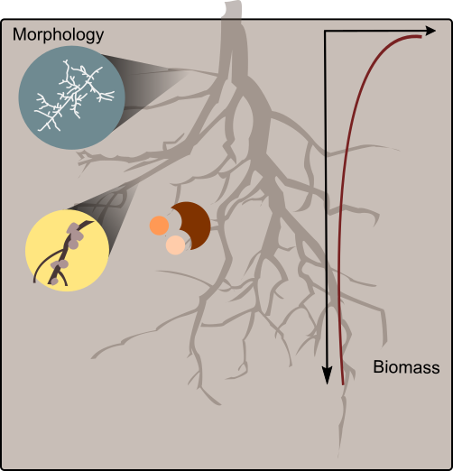
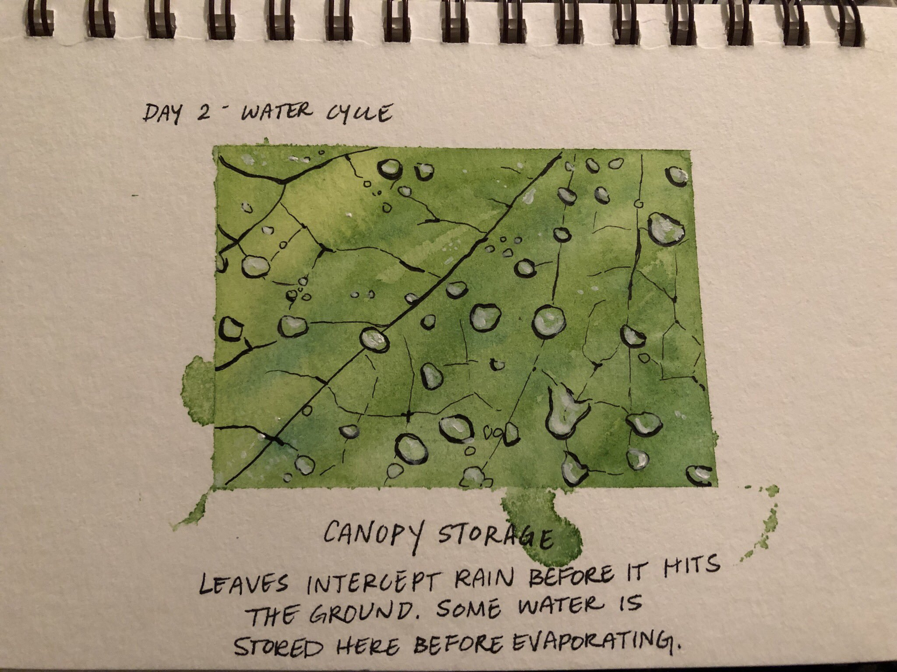

<link rel="stylesheet" href="styles.css" type="text/css">

## Scientific Figures
 

  
&nbsp;
*Original Figure Mockup identifying elements of measured root morphology.*

Cusack, D.F., Addo-Danso, S.D., Agee, E.A., Andersen, K.M., Arnaud, M., Batterman, S.A., Brearley, F.Q., Ciochina, M.I., Cordeiro, A.L., Dallstream, C. and Diaz-Toribio, M.H., 2021. Tradeoffs and synergies in tropical forest root traits and dynamics for nutrient and water acquisition: field and modeling advances. Frontiers in Forests and Global Change, p.161. [https://doi.org/10.3389/ffgc.2021.704469](https://doi.org/10.3389/ffgc.2021.704469) 

[Final Figure](https://www.frontiersin.org/files/Articles/704469/ffgc-04-704469-HTML-r1/image_m/ffgc-04-704469-g001.jpg)

&nbsp; &nbsp; &nbsp;  

## Doodles

